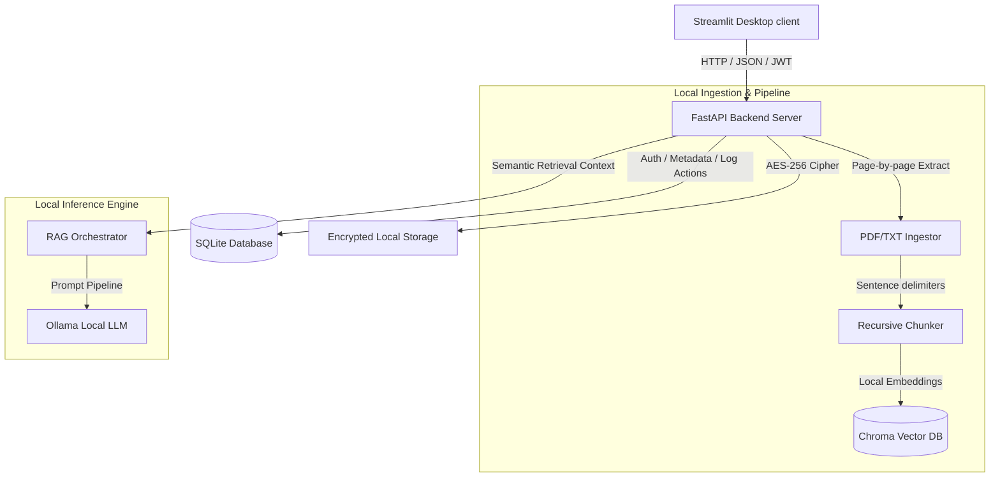

# ⚖️ Aegis Legal AI

Aegis Legal AI is a **production-quality, self-hosted, and fully offline RAG assistant** designed for law firms. Built with absolute privacy and confidentiality in mind, Aegis ensures that sensitive client files, evidence, court orders, and contracts never leave the local hardware.

The application runs entirely within an air-gapped environment, utilizing a local **Ollama** inference engine and local embeddings to power contract audits, document searches, and draft generation.

---

## ⚡ Key Features

* **🔒 Zero-Cloud Confidentiality**: Run entirely on local hardware with zero external API calls. 
* **📁 AES-256 Storage at Rest**: Case files (PDF/TXT) are dynamically encrypted using AES-256 (Fernet cipher) on the filesystem immediately upon upload.
* **💬 Citation-Aware RAG Chat**: Retrieve semantic answers scoped to specific case files. Every response includes precise document page citations (e.g., `[Contract.pdf, Page 12]`).
* **🔍 Contract Risk Auditor**: Automated clause extraction (Termination, Governing Law, Indemnity), critical liability detection (High/Medium/Low), and compliance gap identification.
* **✍️ Context-Grounded Legal Draftsman**: Generate drafts of notices, filings, or contracts using your local files as references.
* **📋 Security Compliance Log**: A tamper-resistant, relational audit trail logging every user login, file upload, search query, and deletion with timestamp, IP, and details.
* **👑 Dynamic Role-Based Access Control**: Simple multi-user permission layers (`Admin`, `Lawyer`, `Auditor`).

---

## 🏗️ System Architecture



---

## 🛠️ Technology Stack

* **Frontend**: Streamlit (Premium customized Dark/Glassmorphic SaaS theme)
* **Backend**: FastAPI (Python)
* **Database**: SQLite (ORM via SQLAlchemy)
* **Vector DB**: ChromaDB (Running locally in persistent client mode)
* **Embeddings**: Local HuggingFace sentence-transformers (`all-MiniLM-L6-v2`)
* **Local Inference**: Ollama (`qwen3:8b` or `llama3:latest`)
* **Security & Auth**: PyJWT (token access) + Bcrypt (native password hashing) + Cryptography (AES-256 Fernet)

---

## 🚀 Running the Standalone Desktop Application

Aegis Legal AI is equipped with **self-bootstrapping startup scripts** for both Windows and macOS/Linux. These scripts automatically verify your Python installation, setup a virtual environment (`venv`), install dependencies, and run the native desktop launcher `desktop_app.py` in one-click.

1. **Clone the Repository**:
   ```bash
   git clone https://github.com/Coderaryanyadav/AegisAI.git
   cd AegisAI
   ```

2. **Launch the Desktop Software**:
   * **macOS / Linux**:
     ```bash
     chmod +x start.sh
     ./start.sh
     ```
   * **Windows**:
     Double-click `start.bat` or run it in Command Prompt:
     ```cmd
     start.bat
     ```

This will automatically launch the **Aegis Legal AI Suite** in its own standalone desktop window. **No web browser tabs or command prompt windows will pop open.**

---

## 📦 Building Standalone Installers for Clients

If you want to package the app into a standalone installer (`.dmg` or `.exe`) that you can directly install on your client's computer (with no Python dependencies required on their end):

### 1. Compile the App Bundle
Run the compiler script to package python and all dependencies:
```bash
python build_desktop.py
```
This produces the compiled app under `dist/AegisLegalAI.app` (macOS) or `dist/AegisLegalAI/AegisLegalAI.exe` (Windows).

### 2. Package the Installer
* **macOS**: Package the app into a double-clickable drag-and-drop disk image installer:
  ```bash
  ./package_dmg.sh
  ```
  This creates `dist/AegisLegalAI.dmg`.
* **Windows**: Use **Inno Setup** with the provided `installer.iss` file to compile a standard setup wizard `dist/AegisLegalAI_Setup.exe`.

### Default Sign-In Credentials (Demo)
* **Email**: `admin@legalai.local`
* **Password**: `adminpassword123`
* *(You can also click the "Autofill Demo" button on the secure sign-in page to fill this in one click)*

---

## 🧪 Running Unit Tests

We maintain strict verification logic for database operations, hashing, encryption, and semantic indexing. Run them using pytest:

```bash
python3 -m pytest
```

---

## 🔍 Troubleshooting & FAQ

### 1. `Ollama service is not running` or `Model qwen3:8b not found`
- **Solution**: Make sure you have downloaded the Ollama app from [ollama.com](https://ollama.com) and that the application is running (you should see the Ollama icon in your taskbar/menubar).
- To pull the recommended model, open a terminal window and run:
  ```bash
  ollama pull qwen3:8b
  ```
- If you run a different model (e.g. `llama3`), Aegis will dynamically fall back to it, but `qwen3:8b` is highly recommended for structured legal drafting.

### 2. `Port 8000` or `Port 8501` already in use
- **Solution**: This happens if another service (or a previous session of Aegis) is already running on those ports.
- On **macOS/Linux**, find and terminate the process:
  ```bash
  lsof -i :8000
  kill -9 <PID>
  ```
- On **Windows**, terminate any uvicorn or python server tasks:
  ```cmd
  taskkill /F /IM python.exe
  ```

### 3. Database is locked / Resetting database
- In developer mode, Aegis stores document metadata, users, and audit trails in a local SQLite file: `data/legal_assistant.db`.
- In compiled standalone mode, client databases are located in their home directory: `~/.aegis_legal_ai/data/legal_assistant.db`.
- If you ever need to reset the system database or start fresh, simply delete the corresponding `legal_assistant.db` file. Aegis will automatically recreate a fresh database and seed the default administrator account on the next startup.

### 4. Binary package errors during `pip install` (e.g. greenlet, bcrypt)
- **Solution**: Ensure your Python installation is up to date, and you have development build tools installed.
- On **macOS**, ensure Xcode Command Line Tools are installed:
  ```bash
  xcode-select --install
  ```
- On **Linux (Ubuntu/Debian)**:
  ```bash
  sudo apt-get install python3-dev build-essential
  ```
