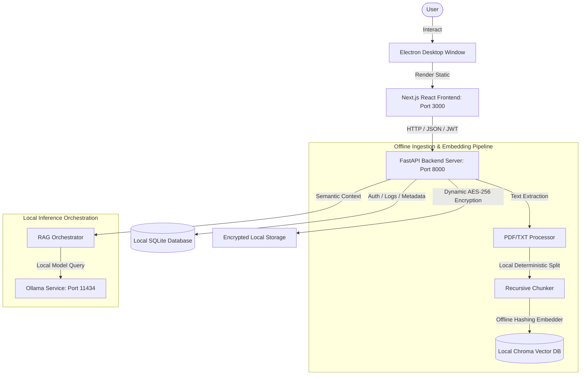

# ⚖️ AegisAI: Enterprise Offline Legal Assistant

AegisAI is a **production-quality, self-hosted, and 100% offline RAG (Retrieval-Augmented Generation) assistant** designed specifically for law firms and corporate legal departments. AegisAI ensures absolute confidentiality: all client case files, documents, evidence, schedules, and credentials remain entirely on local hardware, protected by state-of-the-art offline security layers.

---

## ⚡ Core Features

*   **🔒 Zero-Internet Confidentiality**: Works 100% offline. Bypasses external API and download dependencies via a built-in pre-bundled model and a custom offline embedding function.
*   **📡 eCourts API Sync & Local Data Locking**: Automatically syncs hearings, benches, and details from the official eCourts platform via Case Registration Number (CNR). Once synced, the matter data is locked locally to prevent remote tampering or hijacking.
*   **🛡️ Multi-User RBAC & pyotp 2FA/MFA**: Dynamic role-based access control (`Admin`, `Lawyer`, `Auditor`) with integrated two-factor authentication (2FA) via Authenticator apps (Google Authenticator, Microsoft Authenticator, etc.).
*   **🏢 Custom Firm Branding & Letterheads**: Configure firm name, address, contact, and base64-encoded logo to generate branded professional client communications dynamically.
*   **🚨 Panic Button (Secure Workspace Wipe)**: In case of physical or system compromise, trigger a panic wipe. Instantly scrubs active database records, deletes the local vector store and files, and generates a sealed AES-256 recovery archive in a user-configured location.
*   **💬 Citation-Aware Legal RAG Chat**: Local AI model answers queries grounded directly on uploaded case files (PDF/TXT), providing page-by-page references.
*   **🔍 Contract Risk Auditor & Timeline Generator**: Analyzes uploaded contracts for high/medium/low risks, and constructs an interactive facts timeline.
*   **📊 Dynamic Billing & GST Invoices**: Track hours logged per matter, define billable rates, and generate formal GST-compliant PDF/HTML invoices.

---

## 🏗️ System Architecture



---

## 🛠️ Technology Stack

*   **UI Client**: Next.js (React 19) + Vanilla CSS premium glassmorphic UI + Electron wrapper
*   **Backend**: FastAPI (Python 3.11+)
*   **Database**: SQLite (SQLAlchemy ORM)
*   **Vector Database**: ChromaDB (configured for persistent local filesystem mode)
*   **Offline Embedding Function**: Programmatic hashing vector generator (no ONNX/internet pre-fetch required)
*   **Local Inference**: Ollama (`deepseek-r1:8b`, `llama3.2:3b`, `qwen2.5-coder:3b`, etc.)
*   **Security & Encryption**: PyJWT (session authentication) + pyotp (MFA) + bcrypt (password hashing) + cryptography (AES-256 Fernet ciphers for file vault storage)

---

## 🚀 One-Click Local Development Setup

AegisAI includes fully automated, self-bootstrapping startup scripts for both Windows and macOS.

### 1. Clone the Repository
```bash
git clone https://github.com/Coderaryanyadav/AegisAI.git
cd AegisAI
```

### 2. Launch the Application Suite
*   **macOS / Linux**:
    ```bash
    chmod +x start.sh
    ./start.sh
    ```
*   **Windows**:
    Double-click `start.bat` or run in Command Prompt:
    ```cmd
    start.bat
    ```

The scripts will automatically verify Python 3, create a virtual environment (`venv`), install backend requirements, check for Node.js/NPM, compile `aegis_frontend/node_modules`, check Ollama status, spin up the FastAPI server, and launch the Next.js frontend on `http://localhost:3000`.

---

## 📦 Building Standalone Installers for Clients

To build a standalone installable bundle (`.dmg` or `.exe`) packaging the backend executable, model bundles, Next.js static pages, and the Electron wrapper:

### 1. Compile Backend & Frontend Assets
Run the bundler script:
```bash
python packaging/build_desktop.py
```
This runs PyInstaller to package the FastAPI backend with its local database engines and dependencies under `dist/aegis_backend/`, compiles Next.js pages, and copies them to the Electron wrapper.

### 2. Build Platform Installers
*   **macOS DMG**:
    ```bash
    ./packaging/package_dmg.sh
    ```
    This outputs the Drag-and-Drop installer at `dist_desktop/AegisAI-1.0.0-arm64.dmg`.
*   **Windows Installer**:
    Use **Inno Setup** with the provided `packaging/installer.iss` file to compile a setup wizard executable under `dist_desktop/`.

---

## 🧪 Integration & Validation Testing

AegisAI includes an ultra-thorough, 36-step end-to-end API integration validation suite covering user signup, 2FA generation/verification, eCourts CNR parsing, data locking, encrypted file vault operations, local RAG question-answering, custom invoice drafting, backup snapshotting, and panic wipes.

To run the integration verification test suite:
1. Ensure the FastAPI backend is running (`python aegis_backend/main.py` on port 8000).
2. Execute the test runner:
```bash
PYTHONPATH=. ./venv/bin/python tests/ultra_hardcore_test.py
```

All 36 checks must pass green for a build to be certified for production deployment.

---

## 🔍 Troubleshooting & Resetting

### Database Reset
To wipe the developer database and restore the default state, delete `data/legal_assistant.db` (or delete `~/.aegis_ai/` on client environments). AegisAI will automatically reinitialize a fresh database schema on its next startup.

### Port Collisions
*   FastAPI backend runs on port **8000**.
*   Next.js frontend runs on port **3000**.
*   Ollama service runs on port **11434**.
Please ensure no other services are using these ports before launching the app.
