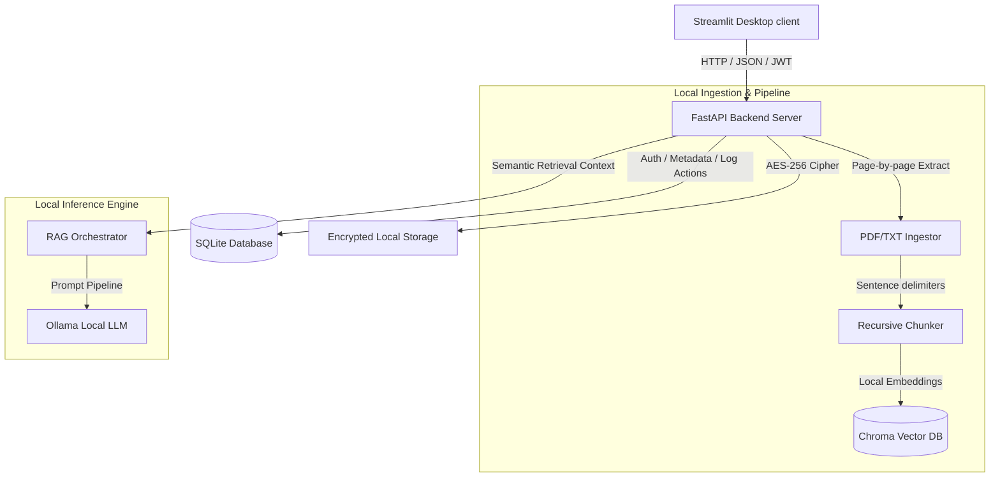

# ⚖️ Aegis Legal AI

Aegis Legal AI is a **production-quality, self-hosted, and fully offline RAG assistant** designed for law firms. Built with absolute privacy and confidentiality in mind, Aegis ensures that sensitive client files, evidence, court orders, and contracts never leave the local hardware.

The application runs entirely within an air-gapped environment, utilizing a local **Ollama** inference engine and local embeddings to power contract audits, document searches, and draft generation.

---

## ⚡ Key Features

* **🔒 Zero-Cloud Confidentiality**: Run entirely on local hardware with zero external API calls. 
* **📁 AES-256 Storage at Rest**: Case files (PDF/TXT) are dynamically encrypted using AES-256 (Fernet cipher) on the filesystem immediately upon upload.
* **💬 Citation-Aware RAG Chat**: Retrieve semantic answers scoped to specific case files. Every response includes precise document page citations (e.g., `[Contract.pdf, Page 12]`).
* **🔍 Contract Risk Auditor**: Automated clause extraction (Termination, Governing Law, Indemnity), critical liability detection (High/Medium/Low), and compliance gap identification.
* **✍️ Context-Grounded Legal Draftsman**: Generate drafts of notices, filings, or contracts using your local files as references.
* **📋 Security Compliance Log**: A tamper-resistant, relational audit trail logging every user login, file upload, search query, and deletion with timestamp, IP, and details.
* **👑 Dynamic Role-Based Access Control**: Simple multi-user permission layers (`Admin`, `Lawyer`, `Auditor`).

---

## 🏗️ System Architecture



---

## 🛠️ Technology Stack

* **Frontend**: Streamlit (Premium customized Dark/Glassmorphic SaaS theme)
* **Backend**: FastAPI (Python)
* **Database**: SQLite (ORM via SQLAlchemy)
* **Vector DB**: ChromaDB (Running locally in persistent client mode)
* **Embeddings**: Local HuggingFace sentence-transformers (`all-MiniLM-L6-v2`)
* **Local Inference**: Ollama (`qwen3:8b` or `llama3:latest`)
* **Security & Auth**: PyJWT (token access) + Bcrypt (native password hashing) + Cryptography (AES-256 Fernet)

---

## 🚀 Getting Started

### Prerequisites

1. **Python**: Python 3.11+ (Fully tested and compliant on Python 3.14.5)
2. **Ollama**: Download and install [Ollama](https://ollama.com/) locally.
3. **Local LLM Model**: Pull a model of choice. E.g.
   ```bash
   ollama pull qwen3:8b
   ```

### Installation

1. **Clone the Repository**:
   ```bash
   git clone https://github.com/Coderaryanyadav/AegisAI.git
   cd AegisAI
   ```

2. **Initialize Virtual Environment**:
   ```bash
   python3 -m venv venv
   source venv/bin/activate
   ```

3. **Install Requirements**:
   ```bash
   pip install -r requirements.txt
   ```

4. **Add Local Keys**:
   Aegis automatically generates a secure Fernet key and writes it to `.env` on first startup if not specified. If you want to specify a key manually:
   ```bash
   echo "ENCRYPTION_KEY=your-url-safe-32-byte-base64-key" > .env
   ```

---

## 🚦 Running the Application

Launch the entire suite with the automated startup script:

```bash
./start.sh
```

The script will launch:
* 🌐 **FastAPI Server**: `http://127.0.0.1:8000` (Swagger docs at `/docs`)
* ⚖️ **Streamlit Client**: `http://127.0.0.1:8501`

### Default Sign-In Credentials
* **Email**: `admin@legalai.local`
* **Password**: `adminpassword123`

---

## 🧪 Running Unit Tests

We maintain strict verification logic for database operations, hashing, encryption, and semantic indexing. Run them using pytest:

```bash
python3 -m pytest
```
