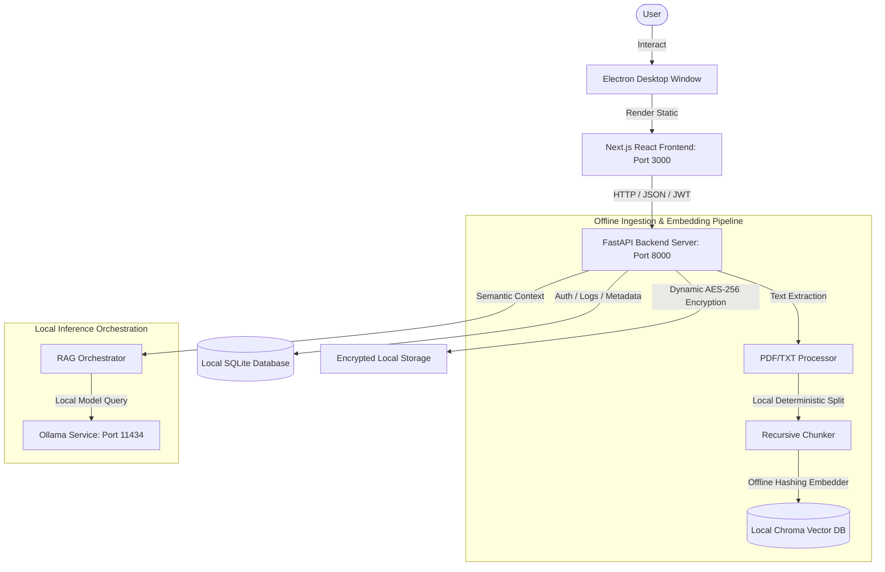

<div align="center">
  
  <h1>⚖️ AegisAI: Enterprise Offline Legal Assistant</h1>
  <p><strong>A production-quality, self-hosted, and 100% offline RAG (Retrieval-Augmented Generation) assistant designed specifically for law firms and corporate legal departments.</strong></p>
  <p>
    
    
    
  </p>
</div>

---

AegisAI ensures absolute confidentiality: all client case files, documents, evidence, schedules, and credentials remain entirely on local hardware, protected by state-of-the-art offline security layers. 

Recently completely overhauled for **maximum performance, zero regression, and a stunning glassmorphic UI**. ⚡

## ✨ Key Features & Enhancements

*   **⚡ Hyper-Optimized Performance Engine**: Deep multi-threaded OCR, SQLAlchemy DB index tracking, and backend JSON response GZIP compression for lightning-fast speeds.
*   **🔒 Zero-Internet Confidentiality**: Works 100% offline. Bypasses external API and download dependencies via a built-in pre-bundled model and a custom offline embedding function.
*   **📡 eCourts API Sync & Local Data Locking**: Automatically syncs hearings, benches, and details from the official eCourts platform via Case Registration Number (CNR). Data is locked locally.
*   **🛡️ Multi-User RBAC & 2FA/MFA**: Dynamic role-based access control (`Admin`, `Lawyer`, `Auditor`) with integrated two-factor authentication via PyOTP.
*   **🚨 Panic Button (Secure Workspace Wipe)**: Instantly scrubs active database records, deletes the local vector store, and generates a sealed AES-256 recovery archive.
*   **💬 Citation-Aware Legal RAG Chat**: Local AI model answers queries grounded directly on uploaded case files (PDF/TXT), providing exact page-by-page references.
*   **📊 Dynamic Billing & GST Invoices**: Track hours logged per matter, define billable rates, and generate formal GST-compliant PDF/HTML invoices.

---

## 🏗️ System Architecture


```mermaid
graph TD
    User([User]) -->|Interact| Electron[Electron Desktop Window]
    Electron -->|Render Static| React[Next.js React Frontend: Port 3000]
    React -->|HTTP / JSON / JWT| FastAPI[FastAPI Backend Server: Port 8000]
    
    FastAPI -->|Auth / Logs / Metadata| SQLite[(Local SQLite Database)]
    FastAPI -->|Dynamic AES-256 Encryption| EncryptedFS[Encrypted Local Storage]
    
    subgraph Offline Ingestion & Embedding Pipeline
        FastAPI -->|Text Extraction| Extractor[PDF/TXT Processor]
        Extractor -->|Local Deterministic Split| Chunker[Recursive Chunker]
        Chunker -->|Offline Hashing Embedder| Chroma[(Local Chroma Vector DB)]
    end
    
    subgraph Local Inference Orchestration
        FastAPI -->|Semantic Context| RAG[RAG Orchestrator]
        RAG -->|Local Model Query| Ollama[Ollama Service: Port 11434]
    end
```

---

## 🛠️ Technology Stack

*   **UI Client**: Next.js (React 19) + Vanilla CSS premium glassmorphic UI + Electron wrapper
*   **Backend**: FastAPI (Python 3.11+) with GZIP payload compression
*   **Database**: SQLite (SQLAlchemy ORM)
*   **Vector Database**: ChromaDB (configured for persistent local filesystem mode)
*   **Local Inference**: Ollama (`deepseek-r1:8b`, `llama3.2:3b`, `qwen2.5-coder:3b`, etc.)
*   **Security & Encryption**: PyJWT + PyOTP + bcrypt + cryptography (AES-256 Fernet ciphers)

---

## 🚀 One-Click Local Development Setup

AegisAI includes fully automated, self-bootstrapping startup scripts for both Windows and macOS.

### 1. Clone the Repository
```bash
git clone https://github.com/Coderaryanyadav/AegisAI.git
cd AegisAI
```

### 2. Launch the Application Suite
*   **macOS / Linux**:
    ```bash
    chmod +x start.sh
    ./start.sh
    ```
*   **Windows**:
    Double-click `start.bat` or run in Command Prompt:
    ```cmd
    start.bat
    ```

> [!NOTE]
> The scripts will automatically verify Python 3, create a virtual environment (`venv`), install backend requirements, compile `aegis_frontend/node_modules`, spin up the FastAPI server, and launch the Next.js frontend on `http://localhost:3000`.

---

## 🧪 Integration & Validation Testing

AegisAI includes an ultra-thorough, 36-step end-to-end API integration validation suite covering user signup, 2FA generation, data locking, encrypted file vault ops, RAG Q&A, and panic wipes.

To run the integration verification test suite:
1. Ensure the FastAPI backend is running.
2. Execute the test runner:
```bash
PYTHONPATH=. ./venv/bin/python tests/ultra_hardcore_test.py
```

---

<div align="center">
  <p>Built with 🖤 for absolute legal confidentiality.</p>
</div>
